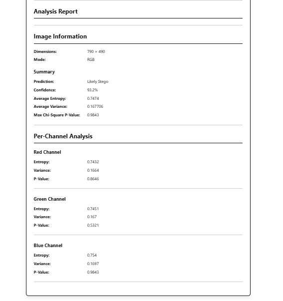

# Image Analysis Microservice

A Python-based Flask microservice for statistical analysis of digital images to identify characteristics commonly associated with steganographic embedding.

The service exposes REST APIs and a simple web interface that analyze uploaded images using multiple statistical techniques and generate a structured analysis report.

---

## Features

- Image upload through Web UI
- REST API for image analysis
- Image metadata extraction
- Histogram-based statistical analysis
- Chi-Square Analysis
- LSB Entropy Analysis
- LSB Variance Analysis
- Pixel Difference Analysis
- Statistical confidence scoring
- JSON response for integration with external applications

---

## Technologies Used

- Python 3
- Flask
- NumPy
- SciPy
- Pillow
- HTML
- CSS

---

## Project Structure

```
stego-analyzer-service/
│
├── analyzer/
│   ├── chi_square.py
│   ├── entropy.py
│   ├── histogram.py
│   ├── pixel_difference.py
│   ├── report.py
│   ├── scorer.py
│   └── variance.py
│
├── routes/
│   └── analyze.py
│
├── templates/
│   └── index.html
│
├── static/
│   └── style.css
│
├── utils/
│
├── config.py
├── app.py
└── requirements.txt
```

---

## Architecture

```
Browser
      │
      ▼
Flask Web Interface
      │
      ▼
Report Analyzer
      │
 ┌────┼──────────┬────────────┬────────────┐
 │    │          │            │            │
Chi  Entropy  Variance  Pixel Difference  Metadata
Square
```

---

## Workflow

1. Upload an image.
2. Validate the file.
3. Extract image metadata.
4. Perform statistical analysis.
5. Generate confidence score.
6. Display analysis report.

---

## API Endpoints

### Health Check

```
GET /health
```

Response

```json
{
  "status": "healthy",
  "service": "Image Analysis Microservice"
}
```

---

### Analyze Image

```
POST /analyze
```

Form Data

```
image=<image_file>
```

Example Response

```json
{
  "status": "success",
  "metadata": {
    "width": 790,
    "height": 490,
    "mode": "RGB"
  },
  "analysis": {
    "summary": {
      "prediction": "Likely Stego",
      "confidence": 85.05
    }
  }
}
```

---

## Screenshots

### Home Page


### Analysis Report



### REST API Response


## Statistical Techniques

- Histogram Analysis
- Chi-Square Analysis
- LSB Entropy
- LSB Variance
- Pixel Difference Analysis

---

## Limitations

- Statistical analysis provides probabilistic evidence rather than guaranteed detection.
- Very small payloads may not significantly alter image statistics.
- Detection effectiveness depends on the embedding technique and characteristics of the cover image.

---

## Future Improvements

- Additional statistical detection methods
- Machine Learning based classification
- Batch image analysis
- Detailed visualization of statistical metrics
- Integration with a Node.js Steganography Platform

---

## Author

**M Kiran**